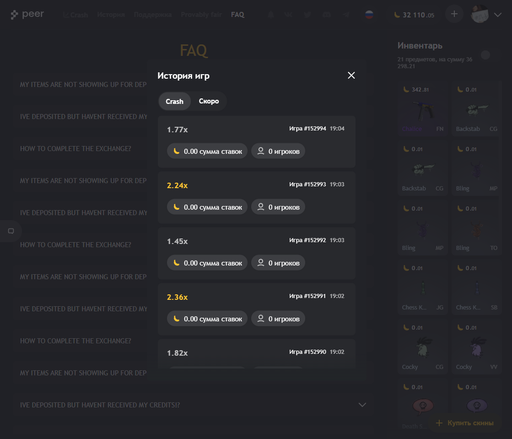

## **Peer** - CS GO Crash game site

**90%** of the Frontend is designed by **me**. For example, I have created:

-   creating a responsive layout,
-   state management (react-hooks and redux)
-   library of components,
-   animations,
-   localize (en, ru)
-   infinite scroll and more
<figure>

<figcaption style="text-align: center;">Profile Page  (Laptop)</figcaption>

  </figure>

<figure>

<figcaption style="text-align: center;">Profile Page, Games History (Laptop)</figcaption>

  </figure>

  <figure>

<figcaption style="text-align: center;">Crash Page (Laptop)</figcaption>

  </figure>

<figure>

<figcaption style="text-align: center;">Modal Window, Shop (Laptop)</figcaption>

  </figure>

  <figure>

<figcaption style="text-align: center;">Support Page (Laptop)</figcaption>

  </figure>

<figure>

<figcaption style="text-align: center;">Modal Window, History (Laptop - Tablet)</figcaption>

  </figure>

 
<figure  >

<figcaption style="text-align: center;">Crash Page (Mobile-M)</figcaption>

  </figure>
  
 
  <figure  >

<figcaption style="text-align: center;">Modal Window, Shop (Mobile-M)</figcaption>

  </figure>

 
<figure  >

<figcaption style="text-align: center;">Inventory (Mobile-M)</figcaption>

  </figure>

 
  <figure  >

<figcaption style="text-align: center;">Opened Menu (Mobile-M)</figcaption>

  </figure>
